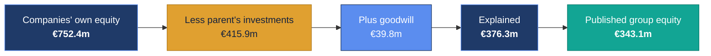
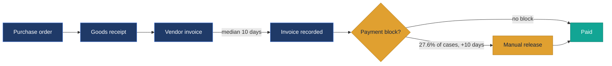

  

  

  
  
  
  

 

Most companies already know their processes are slow. What they usually don't know is **where** the time goes and **which fix pays off first**. That's the work I like: mapping a process step by step, checking it against the data, and turning it into a short list of changes with a number attached.

I studied Computer Science in India, worked as a junior business analyst, and then did a Master in International Business at THWS in Würzburg. So I'm at home on both sides: talking to the people who run a process, and working with the data behind it.

 

## My work

### Group consolidation with real data: Koenig & Bauer

**[group-consolidation-koenig-bauer](https://github.com/ramya-rajendra/group-consolidation-koenig-bauer)** &nbsp;|&nbsp; Excel, Python, ECB exchange rates, SAP Group Reporting mapping

How do the accounts of 40 separate companies turn into one set of group figures? I took Koenig & Bauer, a listed printing press manufacturer from Würzburg, and rebuilt the main consolidation steps from its public 2025 annual report, including currency translation. The part that public data can't explain is documented instead of forced to zero.

```mermaid
flowchart LR
    A["Companies' own equity<br/><b>€752.4m</b>"] --> B["Less parent's investments<br/>€415.9m"]
    B --> C["Plus goodwill<br/>€39.8m"]
    C --> D["Explained<br/><b>€376.3m</b>"]
    D --> E["Published group equity<br/><b>€343.1m</b>"]
    style A fill:#1F3A68,stroke:#5B8DEF,color:#FFFFFF
    style B fill:#E0A030,stroke:#B07818,color:#14213D
    style C fill:#5B8DEF,stroke:#1F3A68,color:#FFFFFF
    style D fill:#1F3A68,stroke:#5B8DEF,color:#FFFFFF
    style E fill:#12A594,stroke:#0B7C6F,color:#FFFFFF
```

| Finding | |
|---|---|
| Consolidation units | **40**, in 13 currencies |
| Remaining gap, documented | **–€33.2m**, mainly holdings between subsidiaries |
| Loss of the parent vs. the group in 2025 | **–€53.5m** vs. **–€13.5m** |
| US subsidiary growth | **+33%** in USD, only **+18%** in EUR |

 

### Zalando app reviews: what users want fixed first

**[zalando-app-review-analysis](https://github.com/ramya-rajendra/zalando-app-review-analysis)** &nbsp;|&nbsp; Python, BigQuery SQL, Power BI, Claude

I tagged 3,000 German Play Store reviews of the Zalando app by theme, sentiment and feature request, checked them against checkout funnel data, and prioritised the fixes with RICE. The top priority became a product requirements document and a [clickable prototype](https://ramya-rajendra.github.io/zalando-app-review-analysis/docs/checkout-prototype/). Personal project, not affiliated with Zalando.

| Finding | |
|---|---|
| Negative reviews about the app itself | **about 390**, more than any other topic |
| "Bug" complaints really about the redesign | **almost half** |
| Checkout starts not completed | **about 55%**, on every device |
| Top priority after RICE | **A more reliable checkout** |

 

### Purchase-to-pay on real company data

**[p2p-real-data-analysis](https://github.com/ramya-rajendra/p2p-real-data-analysis)** &nbsp;|&nbsp; Python, pandas, SQL (DuckDB)

I analysed the BPI Challenge 2019 event log: **1.6 million process steps** from the purchase-to-pay process of a large multinational paint and coatings company, to find out what delays supplier payments.

```mermaid
flowchart LR
    A[Purchase order] --> B[Goods receipt]
    B --> C[Vendor invoice]
    C -- "median 10 days" --> D[Invoice recorded]
    D --> E{Payment block?}
    E -- "27.6% of cases, +10 days" --> F[Manual release]
    E -- "no block" --> G[Paid]
    F --> G
    style A fill:#1F3A68,stroke:#5B8DEF,color:#FFFFFF
    style B fill:#1F3A68,stroke:#5B8DEF,color:#FFFFFF
    style C fill:#1F3A68,stroke:#5B8DEF,color:#FFFFFF
    style D fill:#1F3A68,stroke:#5B8DEF,color:#FFFFFF
    style E fill:#E0A030,stroke:#B07818,color:#14213D
    style F fill:#E0A030,stroke:#B07818,color:#14213D
    style G fill:#12A594,stroke:#0B7C6F,color:#FFFFFF
```

<table>
<tr>
<td width="50%"></td>
<td width="50%"></td>
</tr>
</table>

| Finding | |
|---|---|
| Median time from vendor invoice to payment | **64 days** |
| Paid cases with a payment block | **27.6%**, +10 days |
| Extra time when an invoice is cancelled | **+28 days** |
| Share of paid cases from the 10 largest vendors | **31%** |
| Payment block releases done by hand | **73%** |

<b>What I'd recommend first</b>

 

1. Get the payment terms per vendor and check how much early-payment discount is being lost
2. Automate payment block releases when goods receipt and invoice already match, starting with the largest vendors
3. Talk to the three vendors with the highest block rates. One of them alone has over 10,000 cases, a block on more than half, and a median of 112 days to payment
4. Track invoice-to-record time as a KPI, since every day lost there comes out of the payment window

 

## More work

| | |
|---|---|
| **[Invoice processing](https://github.com/ramya-rajendra/invoice_automation)** | Process analysis and automation prototype that found about €247k a year in lost early-payment discount |
| **[Master's thesis](https://opus4.kobv.de/opus4-fhws/frontdoor/index/index/docId/6594)** &nbsp;([PDF](https://opus4.kobv.de/opus4-fhws/frontdoor/deliver/index/docId/6594/file/Masterarbeit_Rajendra.pdf)) | How AI-driven methods could help value a brand when one company buys another |
| **[Portfolio website](https://ramya-rajendra.github.io/ramya-portfolio/)** &nbsp;([code](https://github.com/ramya-rajendra/ramya-portfolio)) | My work in one place, built with HTML and CSS |
| **[All repositories](https://github.com/ramya-rajendra?tab=repositories)** | Every project, including earlier and smaller work |

 

## Background

| | |
|---|---|
| **Master in International Business** | THWS Würzburg-Schweinfurt, 2025 |
| **B.E., Computer Science** | Visvesvaraya Technological University (VTU), India |
| **Junior Business Analyst** | Sri Guru Raghavendra Food Products, India |
| **Hackathon** | Prize winner at a GitHub hackathon |
| **Languages** | Telugu, English, German (intermediate) |

  
  
  
  
  
  
  
  
  
  

 

---

  Whether it's a process, a financial report or a product decision, I like turning business questions into clear answers backed by data. 
  If that's your world too, <a href="mailto:ramyareddy9488@gmail.com">I'd be glad to connect</a>.

